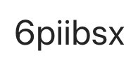

## MLE5004: Computer systems architecture

2026-2027 $1^{st}$ Semester, $1^{st}$ year english

Syllabus: [en](https://www.cs.ubbcluj.ro/files/curricula/2025/syllabus/IE_sem1_MLE5004_en_mihai-suciu_2025_9973.pdf), [ro](https://www.cs.ubbcluj.ro/files/curricula/2025/syllabus/IE_sem1_MLE5004_ro_mihai-suciu_2025_9973.pdf).

## Instructors:

- course: Conf. dr. Mihai Suciu
- seminar:
	- Lect. Dr. CALIN Alina
	- Conf. Dr. CRISTEA Diana
- lab:
	- C.d.asociat BOAMBA Emilia
	- C.d.asociat BRAD Cristian
	- Lect. Dr. CALIN Alina
	- C.d.asociat IOJA IOSIF Andrei
	- C.d.asociat LECHINTAN Tudor
	- Cd.asociat MARGINEAN Tiberius
	- C.d.asociat TODASCA Daniel
	

## Some useful resources
<!-- - you can see your lab grades and lab and seminar attendance status [here](https://ubbcluj.sharepoint.com/:x:/s/2025-2026ComputerSystemsArchitecture-IE-EchipaASC/EXlqtd3_uIFKmJCQNlJ7a-cBZS-WZ0VW8cj8DBAN2MShuw?e=XdQnth) -->
- [link](../../../instr) to instruction reference (just search for the desired instruction in this page and click on the appropriate link)
- [nasm documentation](../../../nasm/nasmdoc0.html)
  - see for instance section [3.2 Pseudo-Instructions](../../../nasm/nasmdoc3.html#section-3.2) for an explanation of 'instructions' used to declare data
	
## Teaching	
	
Teaching activities will take place according to the official timetable displayed on the faculty page. ([link](https://www.cs.ubbcluj.ro/files/orar/2026-1/disc/MLE5004.html))

For communication (announcements, materials) we will use MS Teams, the team is [2026-2027] Computer Systems Architecture - IE, access code:

Students enrolled are asked to join the team. Materials related to the discipline will be posted on MsTeams in the team files section.  

## Course requirements

### Seminar and lab activity:
- __Attendance__ (according to the regulations of the University and Faculty): 
	- __$\geq 75\\%$ compulsory for seminars__ activities, 
	- __$\geq 90\\%$ compulsory for lab__ activities . 
	- No exemption based on extra school activities (eg. job, etc.).

- Students __must participate__ at the seminar and laboratory with their assigned group/subgroup.

- Students with __more than 2 unmotivated absences__ at the seminar OR laboratory will not be able to take the exam in the normal session and or in the retake examination session (this is because seminar and laboratory activity are activities that take place on the following principle “activity along the semester”, and they can not be recovered or repeated for a possible retake examination). Students with medical certificates for each of their absences are exempted from this rule ([see here](https://www.cs.ubbcluj.ro/hotarare-privind-motivarea-absentelor-studentilor-nivel-licenta/)).

__Laboratory assignments__
-  Each lab, students will receive an assignmen twith an associated deadline. Bonus points are awarded for completing these assignments.
- Active participation is directly correlated with laboratory attendance, __meaning__: if the lab assignment is partially or fully completed, the student is considered present. Students who do not perform any activity in the laboratory will not be marked as present.

__Grading policy for practical tests/exams__

During weeks 5 and 9, students will take a practical test during the laboratory. The grading policy for these in-lab practical tests is as follows:
- 0 = The student cannot answer questions about the code, or the solution solves a different problem.
- 1 = The assembly code has syntax errors or compilation errors/warnings.
- 4 = Runtime crash.
- 7 = All of the above are OK but the implementation is not quite complete
- 10 = Complete implementation and correct execution.

__Topic for the laboratory tests__
- Test 1: Conversions, simple arithmetic expressions, complex arithmetic expressions, bitwise operations
- Test 2: Comparison, conditional jump, and looping instructions; operations on byte/word/doubleword/quadword strings; system function calls; text file operations

The __final laboratory grade__ is calculated as the arithmetic mean of the grades obtained on the laboratory tests.

Students are __eligible to take the PRACTICAL EXAM__ only if their laboratory grade is $\geq 5$ and they have a sufficient laboratory attendances.

Students are __eligible to take the WRITTEN EXAM__ only if they have an average grade $\geq5$ for laboratory work (otherwise, students must retake the course in the following academic year).

### Test / partial exam:
- During Week 11, on December 10, 2026, students will take a test during the Course. The material covered by this test will be specified during the lectures. Attendance at this test is mandatory. This is a continuous assessment activity and cannot be retaken.

### Practical exam:
The practical exam will take place between __January 11 and 15, 2027__, during the laboratory sessions. Students are eligible to take the written exam during the regular session only if they achieve a grade of at least 5 on the practical exam. Otherwise, they may only take the exam during the retake session; the grade obtained on the practical exam during the January 11–15, 2027 period will be used to calculate the final grade. If a student fails to attend the practical exam during the January 11–15, 2027 period, the practical exam grade will be 0. __THE PRACTICAL EXAM CANNOT BE RETAKEN!__

The material covered in the practical exam consists of the topics taught across the 9 laboratory sessions (including multi-module ASM+C programming).

You are permitted to use the following reference materials:
- ASM instructions [link](../../../instr)
- C functions
- Assembly/linking/compilation script

__Note__: To solve the practical exam problems, C functions may be used only for I/O operations.

The duration of the practical exam is 1 hour.

During the practical exam, you are permitted to have the following programs open: editor, debugger, cmd, calculator, the exam paper, and a browser (with a maximum of 3 tabs open: script, ASM instructions, and C functions).

### Written exam:
The examination session takes place from January 18, 2027, to February 7, 2027. We will have  two exam dates during this session:
- January 21, 2027
- The second exam date is to be chosen by you, preferably between January 25, 2027, and February 7, 2027.

The session for retakes and grade improvements takes place from February 15, 2027, to February 21, 2027. The exam date scheduled for the __retake session__ is February 15, 2027.
To pass, the grade on the written exam must be $\geq5$.

## For students who failed this course in the past and are taking it again this year:

- According to the faculty regulations, students who failed this course and are retaking it, must comply with all the requirements of the current promotion. As a result:
  - Until the 12th of October 2025 they must contact a teaching assistant and be included in a laboratory group.
  - __All rules/requirements presented above (course/seminar/lab/tests) also apply to students who are retaking the course__.
  - These students will be will be distributed evenly within the groups/subgroups to ensure an even workload.
  - Students will be consistent and will participate in the same time interval at the seminar and laboratory activities.

## laboratory work

