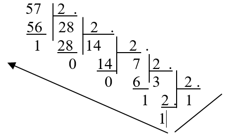

<h1>Laboratory 1 - Theory</h1>

## Converting between different number bases

<h3><i>Learning:</i></h3>

<ul><li>how to convert decimal numbers to the corresponding number in a different base, especially base 16 and 2
</li><li>how to convert a number in a different base, especially 16 and 2, to base 10
</li><li> how to directly convert from base 16 to base 2 and vice versa</li></ul>
<h3><i>Theoretical considerations</i></h3>

A numeral system (or system of numeration) is a writing system for expressing numbers; that is, a mathematical notation for representing numbers of a given set, using digits or other symbols in a consistent manner.

For every numeral system the number of distinct symbols, also called digits, is equal to the base (b). So, for base b=2 (binary numbers) the digits are 0 and 1. For the numeral system with base 16 the symbols are: 0,1,2,3,4,5,6,7,8,9,A,B,C,D,E,F. For numeral systems with the base higher than 10 we use other symbols beside the digits we use in the decimal base. So, for hexadecimal numbers the letters A,B,C,D,E,F correspond to the values 10,11,12,13,14,15. 

Notation: the base is usually written in parenthesis at the end of the number, for example: 100101001(2) or 17A6B(16).

<h3><i>Converting decimal numbers to a different base b</i></h3>

The easiest algorithm is to repeatedly divide by the base b to which we convert the number, keeping track of the remainders. So we divide the number by b, then continue dividing the quotient to b, and so on until the remainder becomes 0. Finally, the number in base b is formed out of the remainders in reverse order.

<h4><i>Example:</i></h4>
<ol>
 	<li>Convert 347 from base 10 to base 16(H)

<!-- 

 -->

Considering the remainders in reverse order we obtain 15B(H).

<pre><code>
347(D) = 15B(H)
</pre></code></li>
<li>Convert 57 from base 10 to base 2(B).

<!-- 

 -->

<pre><code>
57(D) = 111001(B)
</pre></code></li>
</ol>

There is a quick way to convert numbers between base 2 and 16 or vice versa, taking into consideration that each hexadecimal digit corresponds to exactly 4 binary digits::
 
 
<table border="1" cellspacing="0" cellpadding="10" align="center">
<tbody>
<tr>
<td align="center"><strong>Decimal
value
</strong></td>
<td align="center"><strong>Hexadecimal
value
</strong></td>
<td align="center"><strong>Binary number 
corresp. to the hexadecimal digit
</strong></td>
</tr>
<tr>
<td align="center">0</td>
<td align="center">0</td>
<td align="center">0000</td>
</tr>
<tr>
<td align="center">1</td>
<td align="center">1</td>
<td align="center">0001</td>
</tr>
<tr>
<td align="center">2</td>
<td align="center">2</td>
<td align="center">0010</td>
</tr>
<tr>
<td align="center">3</td>
<td align="center">3</td>
<td align="center">0011</td>
</tr>
<tr>
<td align="center">4</td>
<td align="center">4</td>
<td align="center">0100</td>
</tr>
<tr>
<td align="center">5</td>
<td align="center">5</td>
<td align="center">0101</td>
</tr>
<tr>
<td align="center">6</td>
<td align="center">6</td>
<td align="center">0110</td>
</tr>
<tr>
<td align="center">7</td>
<td align="center">7</td>
<td align="center">0111</td>
</tr>
<tr>
<td align="center">8</td>
<td align="center">8</td>
<td align="center">1000</td>
</tr>
<tr>
<td align="center">9</td>
<td align="center">9</td>
<td align="center">1001</td>
</tr>
<tr>
<td align="center">10</td>
<td align="center">A</td>
<td align="center">1010</td>
</tr>
<tr>
<td align="center">11</td>
<td align="center">B</td>
<td align="center">1011</td>
</tr>
<tr>
<td align="center">12</td>
<td align="center">C</td>
<td align="center">1100</td>
</tr>
<tr>
<td align="center">13</td>
<td align="center">D</td>
<td align="center">1101</td>
</tr>
<tr>
<td align="center">14</td>
<td align="center">E</td>
<td align="center">1110</td>
</tr>
<tr>
<td align="center">15</td>
<td align="center">F</td>
<td align="center">1111</td>
</tr>
</tbody>
</table>
 
 
One needs to take into account, when converting from base 2 to base 16, that dividing the binary number into groups of 4 starts from right to left (eventually adding zeros to the left, if necessary).
Then those nibbles (groups of 4 bits) are converted into hexadecimal

<h4><i>Example:</i></h4>
<ol>
 	<li>Convert the decimal number 347 to base 2 and 16.
	<pre><code>
347(D) = 15B(H) = 0001 0101 1011(B)
</code></pre></li>
</ol>

<h4><i>Other examples:</i></h4>

<pre><code>
2 = 2(10) =10(2)
62(10) = 111110(2)
1995(10) = 11111001011(2) 
1024(10) = 10000000000(2)
</code></pre>

<h3><i>Converting a number from a different base to the decimal base</i></h3>

In order to convert a number from a base b to base 10 one can use the following formula. 
If the number in base b is represented as follows:

<pre><code>
<strong>Nr(b) = Cn Cn-1 Cn-2 … C2C1 C0</strong>
</code></pre>

then the value of the number in base 10 can be computed as:

<pre><code>
<strong>Nr(10) = Cn * bn + Cn-1 * bn-1 + … + C2 * b2 +&nbsp; C1 * b1+ C 0</strong>
</code></pre>

<h4><i>Examples:</i></h4>

<ol>
 	<li>Convert the hexadecimal number 3A8(H) to base 10:
<pre><code>
N = 3*162 + 10*16 1 + 8 = 3*256 + 160 + 8 = 936(10)
</code></pre></li>
 	<li>Convert the hexadecimal number 86C(H) to base 10:
<pre><code>
86C(16) = 8 * 162 + 6 * 16 + 12 = 2156(10)
</code></pre></li>
 	<li>Convert the binary number 1101101(2) to base 10:
<pre><code>
1101101(2) = 1*26+1*25+0*24+1*23+1*22+0*2+1=109(10)
</code></pre>
</li>
</ol>

<h4><i>Other examples:</i></h4>

<pre><code>
1010011(2) = 83(10)&nbsp; 
11100011(2) = 227(10) 
1000000000(2) = 512(10)&nbsp;&nbsp;
11001(2) =25(10)
</code></pre>

## Bit. Sign bit. Complementary code. Representing signed integers.
<h3><i>Bit</i></h3>
<ul><li>The reason why computers computes use binary arithmetics is that base 2 is the most suitable for automation among all other bases. A bit represents a binary digit.
</li><li><b>Bit = the basic information unit</b>
</li><li>A bit contains only two possible values: 0 or 1.
</li><li>Depending on the context, a bit can have different meanings, such as 0 or 1, true or false, good or bad, etc. It all depends on the interpretation! 
</li><li>One <b>byte</b> is a sequence of 8 bits, numbered from 0 to 7 as follows::

<table border="1" width="100%" cellpadding="10" style="text-align:center">
<tbody><tr><td>7 high bit</td><td>6</td><td>5</td><td>4</td><td>3</td><td>2</td><td>1</td><td>0 low bit</td></tr></tbody></table> 	 	 	 	 	 	 	 
</li></ul>
<h3><i>Sign bit. Complementary code</i></h3>
 
If we interpret a certain bit configuration as a signed number, then, by convention, a single bit is used for representing the sign of the number. That is the high bit (bit 7) from the high byte of the location, where the number is represented. If the value of this number is 0, then the number is positive. If the value of this bit is 1, then the number is negative.  

<h4>How should signed integers be represented?</h4>
Different methods where proposed:
<ul><li>       <b>Direct code</b>: representing the absolute value of the number on the n-1 bits of the n bits of the location, and use high bit to represent the sign. Although this seem to be the easiest method, it proved to be less efficient than others. One problem is that using this representation: -7 + 7: -7 + 7 ≠ 0
</li><li>       <b>Inverse code (one’s complement)</b>: representing the absolute value of the number on the n-1 bits of the n bits of the location, and if the number is negative invert all n bits of the representation. However, this representation is also not very efficient, for instance the same problem comes up: -7 + 7 ≠ 0)
</li><li>       <b>Complementary code (two’s complement)</b>: for complementing a number representing on n bits, first one has to invert all bits of the representation (0 becomes 1 and 1 becomes 0) and then add 1 to the obtained value. This is the representation that is being used for signed numbers.
 </li></ul>
 
<h4>Alternative rules for the complementary code:</h4>
<ul><li>        Starting from the right part of the representation, leave all bits unchanged up to the first bit with value 1 (including this bit); invert the rest of the bits up to and including bit n-1
</li><li align="center">or
</li><li>        Subtract the binary content of the location from 100..00, where the number of zeros is equal to the number of bits of the location that needs to be complemented
</li><li align="center">or
</li><li>        3.	Subtract the hexadecimal content of the location from 100..00, where the number of zeros is equal to the number of hexadecimal digits of the location that needs to be complemented.
 </li></ul>
The 3 alternative rules are equivalent with the first rule for computing the complementary code.

For example, let’s compute the complementary code for a byte containing the number  (18)10: 

<table border="0" cellspacing="0" cellpadding="0" width="294">
  <tbody><tr>
    <td width="192" valign="top"> 
      Initial location: 
After inverting the bits 
Adding   1 
&nbsp; 
Complement:	  </td>
    <td width="102" valign="top">
00010010 
	11101101 
	11101101+ 
	<u>00000001</u> 
	11101110
</td>
  </tr>
</tbody></table>

  So the complement of the number (18)10  = (12)16 = (00010010)2 , 
  is (11101110)2 = (EE)16 = (238)10  . 
  Using the rule of the binary subtraction:

<table border="0" cellspacing="0" cellpadding="0" width="299">
  <tbody><tr>
    <td width="192" valign="top"> Initial location: 
	Complement:
    </td>
    <td width="107" valign="top">
100000000- 
	<u>&nbsp;00010010</u> &nbsp;11101110
</td>
  </tr>
</tbody></table>

  Using the rule of the hexadecimal subtraction:

<table border="0" cellspacing="0" cellpadding="0" width="298">
  <tbody><tr>
    <td width="191" valign="top"> Initial location: 
	Complement:
    </td>
    <td width="107" valign="top">100- <u>&nbsp;12</u>
	 &nbsp;EE</td>
  </tr>
 
</tbody></table>
<h3><i>Representing signed integers</i></h3>
  An integer between <strong>-2n-1</strong> and <strong>2n-1-1</strong> is represented on a location of n bits as follows: 
<ul><li>If the number is positive, then the location contains the binary representation of the number;
</li><li>If the number is negative, then the location contains the binary representation of the complementary code of the number.
</li></ul>
   
  Observation. The number <strong>-2n-1</strong> cannot be represented on n-1 bits, because there is no space left for the signed bit. Therefore, it is represented on n bits as 100..0 
  On the other hand in the signed representation this indicates a negative number. This number is its own complement, therefore, by convention, <strong>-2n-1</strong> is represented in the complementary code on n bits as 100..0. The same number in the unsigned representation represents the number&nbsp; <strong>2n-1.</strong> 
  <strong>&nbsp;</strong> 
  Examples of different number representation on locations with different sizes:. 

<table border="1" cellspacing="0" cellpadding="0" width="591">
  <tbody><tr>
    <td width="93" valign="top"> 
     Location size (bytes) </td>
    <td width="90" valign="top">Number in base 10</td>
    <td width="181" valign="top">Representation of the complementary code (hexadecimal)</td>
    <td width="227" valign="top">Representation of the complementary code 
(binary)
</td>
  </tr>
  <tr>
    <td width="93" valign="top">1</td>
    <td width="90" valign="top">0</td>
    <td width="181" valign="top">00</td>
    <td width="227" valign="top">00000000</td>
  </tr>
  <tr>
    <td width="93" valign="top">2</td>
    <td width="90" valign="top">0</td>
    <td width="181" valign="top">0000</td>
    <td width="227" valign="top">0000000000000000</td>
  </tr>
  <tr>
    <td width="93" valign="top">1</td>
    <td width="90" valign="top">1</td>
    <td width="181" valign="top">01</td>
    <td width="227" valign="top">00000001</td>
  </tr>
  <tr>
    <td width="93" valign="top">2</td>
    <td width="90" valign="top">1</td>
    <td width="181" valign="top">0001</td>
    <td width="227" valign="top">0000000000000001</td>
  </tr>
  <tr>
    <td width="93" valign="top">1</td>
    <td width="90" valign="top">-1</td>
    <td width="181" valign="top">FF</td>
    <td width="227" valign="top">11111111</td>
  </tr>
  <tr>
    <td width="93" valign="top">2</td>
    <td width="90" valign="top">-1</td>
    <td width="181" valign="top">FFFF</td>
    <td width="227" valign="top">1111111111111111</td>
  </tr>
  <tr>
    <td width="93" valign="top">1</td>
    <td width="90" valign="top">127</td>
    <td width="181" valign="top">7F</td>
    <td width="227" valign="top">01111111</td>
  </tr>
  <tr>
    <td width="93" valign="top">2</td>
    <td width="90" valign="top">127</td>
    <td width="181" valign="top">007F</td>
    <td width="227" valign="top">0000000001111111</td>
  </tr>
  <tr>
    <td width="93" valign="top">1</td>
    <td width="90" valign="top">-128</td>
    <td width="181" valign="top">80</td>
    <td width="227" valign="top">10000000</td>
  </tr>
  <tr>
    <td width="93" valign="top">2</td>
    <td width="90" valign="top">-128</td>
    <td width="181" valign="top">FF80</td>
    <td width="227" valign="top">1111111110000000</td>
  </tr>
  <tr>
    <td width="93" valign="top">2</td>
    <td width="90" valign="top">128</td>
    <td width="181" valign="top">0080</td>
    <td width="227" valign="top">0000000010000000</td>
  </tr>
  <tr>
    <td width="93" valign="top">2</td>
    <td width="90" valign="top">32767</td>
    <td width="181" valign="top">7FFF</td>
    <td width="227" valign="top">0111111111111111</td>
  </tr>
</tbody></table>
  <h3><i>Why the complementary code?</i></h3>

  The implementation of integer operations needs to be efficient and to use, as much as possible, comon algorithms from the fundamental operations on integers regardless of the representation convention.   
  The complementary code best meets the aboe requirements so far. Two main reasons for that are:
<ul><li>The addition operations is executed the same in the signed and unsigned representation. It is a simple addition of the n bits of the location, ignoring the last transport. 
</li><li>The subtraction is reduced to the addition of the first number with the complement of the second
</li></ul>
  The multiplication and division have seperate algorithms for the signed and unsigned representation, however the percentage of additions and subtractions is a lot higher than the one of multiplications and divisions. Therefore, the complementary code is an efficient representation for integers. 
  Another advantage is that, when working with positive numbers (this is decided from the beginning), the sign bit is not lost, and the representation interval is much larger.
  <h4>Representation dimension</h4>
  There are certain restrictions, the most important of which is the dimension of the representation, i.e. the maximum number of binary digits (number of bits) from the representation of an integer. We denote by n the representation dimension. 
  The possible values of n for computers nowadays are: 8, 16, 32 and 64. 
  Problem: if we have a number on 7 bits, how do we represent it on 8 bits?  
  Answer: it depends on the interpretation
<ul><li>In the unsigned representation we add zeros to the remaining high bits 
  </li><li>In the signed representation we add the sign bit to the remaining high bits 
  </li><ul>
  Example:
  (10011)2 is represented on a byte as follows: 
  <ul><li>(00010011)2 in the unsigned representation 
  </li><li>(11110011)2 in the signed representation 
  </li></ul>
  In the next table we can see the intervals that can be represented on a location of different sizes, both for the signed and unsigned representation. 

<table border="1" cellspacing="0" cellpadding="0" width="612">
  <tbody><tr>
    <td width="66" valign="top"> 
      No. of 
      bytes </td>
    <td width="231" valign="top">
Unsigned representation
</td>
    <td width="315" valign="top">
Signed representation
</td>
  </tr>
   <tr>
    <td width="66" valign="top">
1
</td>
    <td width="231" valign="top">
[0, 28-1]&nbsp; = [ 0 , 255 ]
</td>
    <td width="315" valign="top">
[-27 ,    27-1]&nbsp;&nbsp;&nbsp; = [-128 , 127]
</td>
  </tr>
  <tr>
    <td width="66" valign="top">
2
</td>
    <td width="231" valign="top">
[0, 216-1]    = [ 0 , 65535 ]
</td>
    <td width="315" valign="top">
[-215    , 215-1] = [-32 768 , 32 767]
</td>
  </tr>
  <tr>
    <td width="66" valign="top">
4
</td>
    <td width="231" valign="top">
[0, 232-1]    = [ 0 , 4 294 967 295 ]
</td>
    <td width="315" valign="top">
[-231    , 231-1] = [-2 147 483 648 , 2 147 483 647]
</td>
  </tr>
  <tr>
    <td width="66" valign="top">
8
</td>
    <td width="231" valign="top">
[0, 264-1]    = [ 0 , 18 446 824 753 
      389 551 615 ]
</td>
    <td width="315" valign="top">
[-263    , 263-1] = [-9 223 412 376 694 775 808 , 
      9 223 412 376 694 775 807]
</td>
  </tr>
</tbody></table>
 
## Tools for laboratories
	
<ul>
<li>Editor: Notepad++</li>
<li>Assembler: NASM</li>
<li>Linker: ALINK</li>
<li>Debugger: Olly DBG</li>
</ul>

The set of tools can be downloaded here: [🔗 ASM tools](../ASM_tools.zip).

Students that use other operating systems besides Windows can use an emulator (the tools have been succesfully tested with Wine), or run the tools in Windows virtual machine. The set of tools already contains the editor Notepad++ which has an integrated plugin which allows you to perform most operations with a few key combinations.

- Students that use other operating systems besides Windows can use the Windows virtual machine available [🔗 here](https://ubbcluj.sharepoint.com/:u:/s/ASCIR2021-2022/EZKJja_WcUxPt0BZwprnMBUBt_aDiJv5hYIb8pWHIlIuBg?e=OAH7E0)

<h3><i>Instructions:</i></h3>

<ul>
	<li>Download the set of tools and unzip it
	</li><li>Start the editor Notepad++ from the directory npp (don’t use the own version of Notepad++)
	</li><li>Use the editor to implement the given laboratory problems. You can use the following key combinations that can also be found in the menu Plugins -> ASM Plugin:
	<ul>
		<table border="1" cellspacing="0" cellpadding="10">
		<tbody><tr><td  align="center">ASM Code Template</td><td  align="center">Ctrl+Shift+N</td><td  align="center">Fills in the editor a minimal ASM program
		</td></tr><tr><td  align="center">Build ASM</td><td  align="center">Ctrl+F7</td><td  align="center">Assemblies the current program
		</td></tr><tr><td  align="center">Run program</td><td  align="center">Ctrl+F6</td><td  align="center">Runs the current program
		</td></tr><tr><td  align="center">Debug program</td><td  align="center">F6</td><td  align="center">Debugs the current program, using Olly Debugger (the debugger documentation can be found in the ollydb directory from the archive)
				</td></tr></tbody></table>
	</ul>
</li></ul>
	

## Structure of a program in assembly

Example
	
<pre><code>bits 32 ;assembling for the 32 bits architecture
global start

; we ask the assembler to give global visibility to the symbol called start 
;(the start label will be the entry point in the program) 
extern exit ; we inform the assembler that the exit symbol is foreign; it exists even if we won't be defining it
import exit msvcrt.dll  ; we specify the external library that defines the symbol
        ; msvcrt.dll contains exit, printf and all the other important C-runtime functions

; our variables are declared here (the segment is called data) 
segment data use32 class=data
; ... 

; the program code will be part of a segment called code
segment code use32 class=code
start:
; ... 

    ; call exit(0) ), 0 represents status code: SUCCESS
    push dword 0 ; saves on stack the parameter of the function exit
    call [exit] ; function exit is called in order to end the execution of
the program

</code></pre>

## Exercices

In your notebooks, solve and explain the following exercises:

1. Convert the following numbers from base 10 to 2 and then to 16: 
- 4
- 10
- 15
- 32

2.	Convert the following numbers from base 10 to 16 and then to 2:

<ul>
<li>3</li>
<li>11</li>
<li>16</li>
<li>17</li></ul> 

3.	Convert the following numbers from base 2 to 16:

<ul>
	<li>1010</li>
        <li>0111</li>
        <li>1111</li>
        <li>10001010</li>
        <li>110101111</li>
</ul>

4.	Convert the following numbers from base 16 to 2:

<ul>
        <li>3</li>
        <li>A</li>
        <li>F</li>
        <li>2B</li>
        <li>2F8</li>
</ul>

5.	Compute the following expressions directly in base 2 (without converting to base 10):

<ul>
        <li>1+1</li>
        <li>10+10</li>
        <li>111+1</li>
        <li>1010-1</li>
        <li>1000-10</li>
</ul>

6.	Compute the following expressions directly in base 16 (without converting to base 10):

<ul>
        <li>9+1</li>
        <li>B+2</li>
        <li>F+1</li>
        <li>10+A</li>
        <li>10-2</li>
        <li>B-3</li>
</ul>

7.	Check, using at least two of the complementary code rules, if:

<ul><li> (9A7D)16 and (7583)16 are complementary in a location of 2 bytes 
  </li><li>  (000F095D)16 and (FFF0F6A3)16 are complementary in a location of 4 bytes</li>
  <li> (4BA1)16  and (5C93)16  are complementary in a location of 2 bytes</li>
<li>(7F)16 and (81)16 are complementary in a location of 1 byte</li>
  <li> (732A)16  and (4E58)16  are complementary in a location of 2 bytes</li>
</ul>

8. Write the 8-bits unsigned representation for the following numbers:

<ul><li> 8</li><li> 67</li><li> 230</li></ul>

9. Write the 16-bits signed representation for the following numbers:

<ul><li> -6</li><li> -121</li><li> 70</li></ul>

