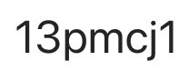

## MLR5025: Algoritmica grafelor

2025-2026, Semestrul 2, anul 1, IR

Syllabus: [ro](https://www.cs.ubbcluj.ro/files/curricula/2025/syllabus/IR_sem2_MLR5025_ro_mihai-suciu_2025_9510.pdf).

__Curs, Seminar__: SUCIU Mihai

__Laborator__:
- CAPILNAS Matei
- MARINESCU Alexandru
- POP Ioan Daniel

### Organizare
- Activitățile didactice se vor desfășura conform orarului oficial afișat pe pagina facultății ([link](https://www.cs.ubbcluj.ro/files/orar/2025-2/disc/MLR5025.html)).

- Pentru comunicare (anunțuri, materiale) vom folosi MS Teams, este creată echipa MLR5025: Algoritmica grafelor (2025-2026), codul de acces este:  
Studenții înscriși la această disciplină sunt rugați să adere la echipă. Materialele aferente disciplinei vor fi postate pe MsTeams în secțiunea files a echipei.

___

### Cerințe:

Activitatea de seminar este OBLIGATORIE în proporţie de minim 75% conform reglementărilor Universităţii şi ale Facultăţii. Ca urmare, se admit <strong>maxim 2 absențe nemotivate la seminar</strong>. De asemenea, se admite <strong>o absență nemotivată la laborator</strong> (activitatea de laborator fiind OBLIGATORIE în proporție de 90%). Nu se admit scutiri pe baza unor activități extrașcolare (student angajat etc.). Pentru situații speciale, este posibilă prezentarea la seminarul/laboratorul din  săptamâna curentă cu o altă grupă/subgrupă de comun acord cu profesorul coordonator ce conduce seminarul/laboratorul.

<strong>Studenții cu mai mult de 2 absente NEMOTIVATE la seminar SAU o absență NEMOTIVATĂ la laborator nu vor fi primiți NICI la examenul din sesiunea normală şi NICI la examenul din sesiunea de restanţe (aceasta deoarece activitatea de seminar ȘI cea de  laborator sunt activități ce se desfăşoară pe principiul &ldquo;activitate pe  parcurs&rdquo; şi acestea nu pot fi recuperate sau repetate pentru o eventuală sesiune de restanţe (aceşti studenţi vor trebui să repete acest curs în anul universitar următor)</strong>. Sunt exceptați de la această cerință cei scutiți medical care pot dovedi cu acte fiecare absență în parte.

Nota acordată unei activități este stabilită de către profesorul coordonator al subgrupei în urma prezentarii rezolvării de către student. Criteriile care stau la baza acordarii  notei sunt:

<ol>
<li>Demonstrarea  funcționării problemei.</li>
<li>Înțelegerea soluției implementate, corectitudinea și eleganța soluției alese de  către student.</li>
<li>Calitatea, eficiența și claritatea textelor  sursa aferente, precum și a documentației însoțitoare (comentarii și explicații  ale modului în care a fost dezvoltat textul sursă în raport cu cerintele).</li>
<li>Abilitatea de a transforma relativ ușor  implementarea și a o adapta la soluționarea altor probleme înrudite, eventual  prin adăugarea / modificarea unor cerințe inițiale.</li>
</ol>

 <strong> Studentul va avea dreptul să se prezinte la examenul scris doar dacă are minim media 5 la activtatea de laborator (în caz contrar studentul va trebui să repete acest curs în anul universitar următor). </strong>

Prezența la activitățile didactice:

- prezența la laborator implică rezolvarea și predarea a cel puțin unei cerințe primite în laboratorul respectiv, se acceptă soluții parțiale;