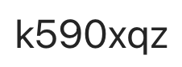

Instructor: Mihai Suciu

[Syllabus](https://www.cs.ubbcluj.ro/files/curricula/2023/fise_discipline_cyber/AdvancedSoftwareSecurity_MME8199_CS_en_MihaiSuciu.pdf)

Teaching activities will take place according to the official timetable displayed on the faculty page. ([link](https://www.cs.ubbcluj.ro/files/orar/2024-1/disc/MME8199.html))

For communication (announcements, materials) we will use MS Teams, the team is MME8199: Advanced Software Security (2024-2025), access code:

Students enrolled are asked to join the team. Materials related to the discipline will be posted on MsTeams in the team files section.  

### Evaluation
- 60% written exam
- 40% practical exam
- 1 point bonus for extra work

