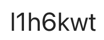

2025-2026 $1^{st}$ Semester, $2^{nd}$ year, Cyber Security

Instructors: 
- Mihai Suciu
- C.d.asociat LUNGANA-Niculescu Alexandr

Syllabus: [en](https://www.cs.ubbcluj.ro/files/curricula/2023/fise_discipline_cyber/AdvancedSoftwareSecurity_MME8199_CS_en_MihaiSuciu.pdf), [ro](https://www.cs.ubbcluj.ro/files/curricula/2025/syllabus/CS_sem3_MME8199_en_mihai-suciu_2025_9598.pdf)

Teaching activities will take place according to the official timetable displayed on the faculty page. ([link](https://www.cs.ubbcluj.ro/files/orar/2025-1/disc/MME8199.html))

For communication (announcements, materials) we will use MS Teams, the team is MME8199 (2025-2026), access code:

Students enrolled are asked to join the team. Materials related to the discipline will be posted on MsTeams in the team files section.  

### Evaluation
- 60% written exam
- 40% practical exam
- 1 point bonus for extra work

