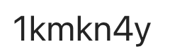

2025-2026 $1^{st}$ Semester, $1^{st}$ year Artificial Intelligence for Connected Industries

Instructor: 
- Mihai Suciu

Syllabus: [en](https://www.cs.ubbcluj.ro/files/curricula/2025/syllabus/AI4CI_sem1_ABC1234_en_mihai-suciu_2025_9599.pdf), [ro](https://www.cs.ubbcluj.ro/files/curricula/2025/syllabus/AI4CI_sem1_ABC1234_ro_mihai-suciu_2025_9599.pdf)

Teaching activities will take place according to the official timetable displayed on the faculty page. ([link](https://www.cs.ubbcluj.ro/files/orar/2026-1/disc/MME8215.html))

For communication (announcements, materials) we will use MS Teams, the team is MME8215 OR (2026-2027), access code:

Students enrolled are asked to join the team. Materials related to the discipline will be posted on MsTeams in the team files section.  