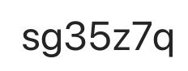

Curs opțional, an III.

## Organizare
- Activitățile didactice se vor desfășura conform orarului oficial afișat pe pagina facultății ([link](https://www.cs.ubbcluj.ro/files/orar/2024-1/disc/MLR8114.html)).

- Pentru comunicare (anunțuri, materiale) vom folosi MS Teams, este creată echipa MLR8114: Securitate software (2024-2025), codul de acces este:  
Studenții înscriși la această disciplină sunt rugați să adere la echipă. Materialele aferente disciplinei vor fi postate pe MsTeams în secțiunea files a echipei.

- Pentru Moodle, studenții trebuie să se inregistreze la curs ([link](https://moodle.cs.ubbcluj.ro/moodle/course/view.php?id=27)).

## Introducere

- [Syllabus](https://www.cs.ubbcluj.ro/files/curricula/2023/syllabus/IR_sem5_MLR8114_ro_mihai-suciu_2023_7758.pdf)

### Obiective
- să invățăm să devoltăm soft mai sigur: proiectare, implementare;
- scrie cod sigur
  - cunoaște și înțelege vulnerabilități soft obișnuite
  - evitarea acestor vulnerabilități (design, API securizat)
- code review/audit din punct de vedere al securității
  - stiți ce să căutați în cod
  - stiți cum să cautați vulnerabilități de securitate (instrumente, strategii, etc.)
- tratarea vulnerabilităților găsite
  - evaluarea probabilității ca vulnerabilitatea gasită să fie exploatată
  - evaluarea importanței vulnerabilității gasite (ex. minoră, severă, critică)

### Metoda de evaluare și cerințe
- 20% Activitate proiecte (in cadrul laboratorului); nu se impune nota minima
- 40% Activitate la laborator (4 teste grila pe Moodle, sustinute pe parcursul semestrului); media testelor trebuie sa fie cel putin 5, iar nota minima la un test de laborator trebuie sa fie 1.
- 40% Colocviu (test grila pe Moodle); nota minima trebuie sa fie 5
- 1 punct bonus pentru activitate deosebita la laborator
- Restante
  - Pentru restante formula ramane identica. Nota pe colocviu se inlocuieste cu nota obtinuta la un nou test, sustinut in sesiunea de restante.
  - In sesiunea de restante nu se poate recupera punctajul pentru activitate la curs, respectiv pt activitate la laborator!
- Este necesar un numar de minim 10 prezente la laborator. 
- Este necesara participarea studentilor la ambele ore de laborator pentru a fi luata in considerare prezenta.

